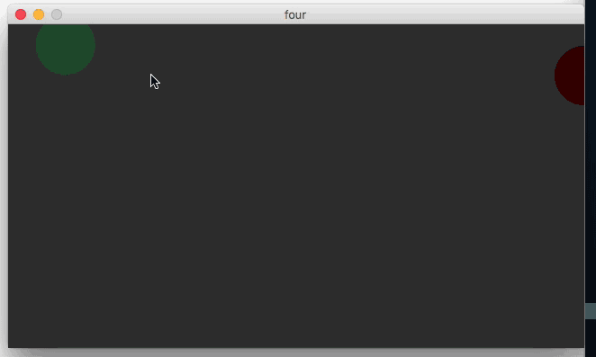

# Project 00

For whatever reason when running sketches locally there seemed to be some delay in response, which may come through in the animations below

## 1. Draw a circle with a stroke and a fill in the center of the screen

## 2. Draw 200 circles of increasing size and color value in a rectangular grid

## 3. Animate a circle so it chases your cursor, like a ghost chasing after Pac-Man

## 4. Draw three circles with different personalities that chase your cursor

