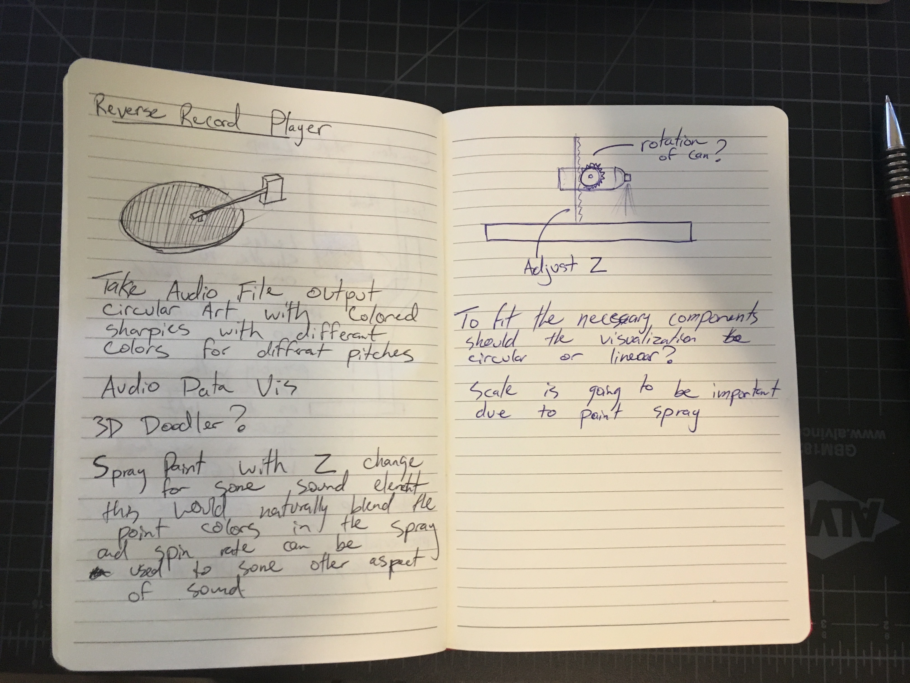

# Project 01 - Artifactory

My concept is to pull in audio files, specifically songs, and output them as paint display. I plan to create an output that would, in a way, reference how vinyl is read to produce audio. In a way create this new kind of vinyl that would describe the song at hand.

Scale is a concern of mine due to the paint spray produced by the cans. In a similar vain the idea of the output being circular may eliminate the expressiveness of the drawing has it will all be compressed. This will also depend on how many colors I want to include in the visual and how these colors would correspond to the input, the song file.

The idea of having 2 degrees of freedom of the paint can, both a z height and rotation relative to paper, I would to add another dimension to the piece, but it will be important to see what data I can pull from an audio file and what each will show.

From a mechanical aspect I need to make sure the system holding up the cans can smoothly and reliably adjust with the weight of the can, the motor needed to rotate the can and the paint trigger.
