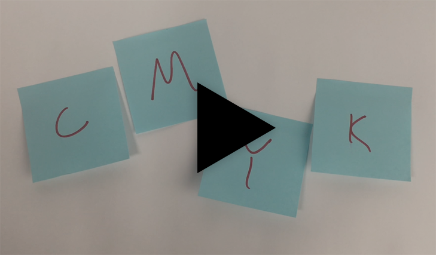
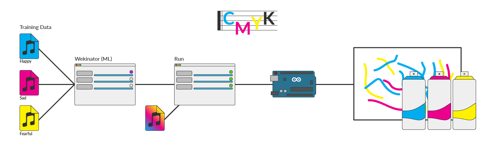
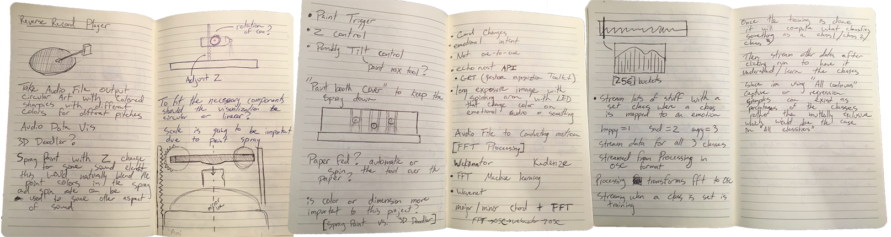
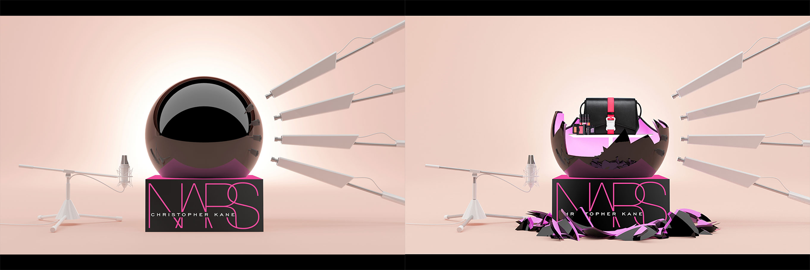
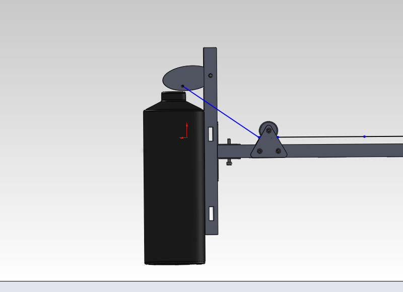

# Project 01 - Artifactory

The idea of this project was to learn about audio processing and look at how I could use machine learning with a design or art piece, both of these things were new to me, which made this project more exciting. I ended up building a system that would map emotions to songs using Wekinator, a machine learning platform, and then had the algorithm control spray paint cans that mapped to the original emotions. In my case cyan was happy, magenta was sad and yellow was fear. As part of the system the user was meant to be the conductor of the paint, deciding where the paint should be applied, but not when as that was handled by the ML algorithm. Giving a unique image for every song as it depends on the participants feeling at the moment for that particular song.

## Process

My original concept was to process audio, specifically songs, and output them as a paint display. I planned to create an output that would, reference how vinyl is read to produce audio. In a way create this new kind of vinyl that would describe the song at hand. Creating a visual vinyl of you will. In creating a like sized output to a record I was concerned if you would be able to understand any of the audio changes or if the spray from the cans would make everything look more or less uniform.

Originally my system was going to be completely independent of user interaction, but through conversation though it would be best to include the user and have them act as the conductor to the music being heard. Have the system handle the type of paint spray but the user acts are the placement of the paint. By involving the user it also reduced the mechanical complexity of the system, which in short projects especially its important to keep it simple.

After coming up with this original concept, I was pushed to make a more interesting piece. As part of pushing the concept further I returned to the web to see what all is out there.

I re-found the following neat projects:
[Breakthrough by The Guild](http://guildisgood.com/project?item_id=76)

[Chalkbot by Deeplocal](http://www.deeplocal.com/projects/chalkbot.html)

<iframe width="100%" height="600" src="https://www.youtube.com/embed/Eq2dvGwaHzs" frameborder="0" allowfullscreen></iframe>

I was also thinking about what if the user acted as a conductor for the music? Could I transform an audio file into a conductors movements and communicate that through paint trigger? As this was a short project and do not know much about conducting and all that is entailed, I decided to table this idea for the time being.

Possible Spray can mechaninism

[Source: fabacademy.org](http://fabacademy.org/archives/2013/students/anderson.douglas/week%2016%20-%20applications.html)

