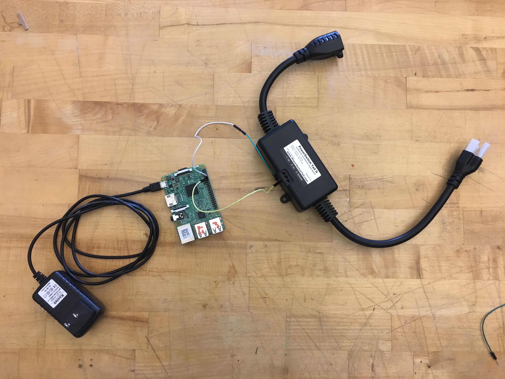

# Project 02 - Monitor & Alert

For this project, the idea was to pull in a digital data source and give a physical output. Due to many conversations around news and news outlets specifically around how easy it is to create and propagate news. I decided to create a tool that would turn your TV off when there was a lot of news being published to twitter to reduce your instant consumption of bits of a story, waiting until the full story was published. A physical media disconnect.

source: [giphy](http://giphy.com/gifs/miramax-amelie-unplug-nosoccer-nosignal-vengeance-TZXSOs53Frg0E)

